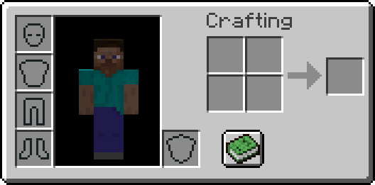
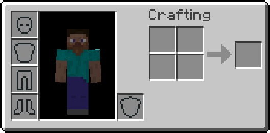

# NoRecipeBook

A Fabric/Quilt mod that removes the recipe book from the players inventory.

## 🖼️ Showcase

| Vanilla Minecraft                                 | With this mod                                        |
| ------------------------------------------------- | ---------------------------------------------------- |
|      |      |
|  |  |

## 📥 Downloads

You can download this mod from:
* [Modrinth](https://modrinth.com/mod/norecipebook)
* [CurseForge](https://www.curseforge.com/minecraft/mc-mods/norecipebook-fabric)

## 🎲 Version support

| Minecraft version | Latest mod version | Support status            |
| ----------------- | ------------------ | ------------------------- |
| 1.21.2 - 1.21.11  | `3.12`             | :heavy_check_mark: Active |
| 1.21.0 - 1.21.1   | `3.4`              | :x: Obsolete              |
| 1.20.5 - 1.20.6   | `3.2`              | :x: Obsolete              |
| 1.20.3 - 1.20.4   | `3.1`              | :x: Obsolete              |
| 1.20.2            | `3.0`              | :x: Obsolete              |
| 1.14.0 - 1.20.1   | `2.4`              | :x: Obsolete              |
| 1.12.2, 1.13.2    | `2.4`              | :warning: Bug fixes only  |

Starting with v3.0 this mod will only be developed for the latest Minecraft version and maybe some older legacy versions I still care about.
