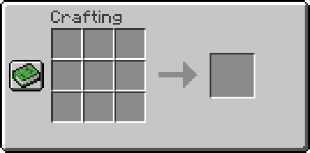

# NoRecipeBook
A **Fabric** mod that removes the recipe button from the players inventory.

## 🖼️ Showcase

| Vanilla Minecraft                                 | With this mod                                        |
| ------------------------------------------------- | ---------------------------------------------------- |
|      |      |
|  |  |

## 📥 Downloads

You can download this mod from:
* [Modrinth](https://modrinth.com/mod/norecipebook-fabric)
* [CurseForge](https://www.curseforge.com/minecraft/mc-mods/norecipebook-fabric)

## 🎲 Supported versions

| Minecraft version | Support                   |
| ----------------- | ------------------------- |
| 1.20.x            | :heavy_check_mark: Active |
| 1.19.x            | :heavy_check_mark: Active |
| 1.18.x            | :heavy_check_mark: Active |
| 1.17.x            | :heavy_check_mark: Active |
| 1.16.x            | :heavy_check_mark: Active |
| 1.15.x            | :heavy_check_mark: Active |
| 1.14.x            | :heavy_check_mark: Active |
| 1.13.2            | :heavy_check_mark: Active |
| 1.12.2            | :heavy_check_mark: Active |
